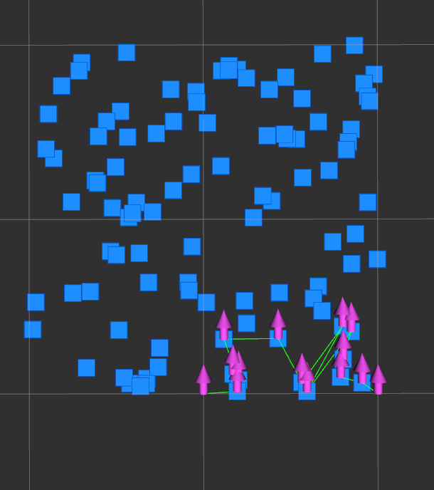

# ur5e_simulation
ur5e_simulation

### 1. Requirements
System: Ubuntu 18.04, Ubuntu 20.04   

ROS: Melodic, Noetic    
 
Moveit   

Gazebo   

### 2. Other Dependencies
For some dependencies were missed for the project, please check the following instructions.
```
sudo apt-get install ros-melodic-moveit-visual-tools
sudo apt-get install ros-melodic-ros-controllers
```

Furthermore, one more gripper plugin was needed for the project.
```
cd <home>
git clone https://github.com/wangarcher/plugins.git
cd roboticsgroup_gazebo_plugins
mkdir build && cd build
cmake ..
make 
```
**PLEASE BE ADVISED!The following command would directly write a new .so lib into the system lib folder. It's effective, but a little bit dangerous.**
```
sudo cp devel/lib/libroboticsgroup_gazebo_mimic_joint_plugin.so /usr/lib/x86_64-linux-gnu/<gazebo-9>or<gazebo-11>/plugins/
```

**NOTE:**There might be more dependencies needed due to vairous reasons. If you found any, please let me know.(archer7wang@outlook.com)

### 3. Usage
Like ordinary ros projects, the simluation needs a clean workspace.
```
mkdir -p ur5e_sim_ws/src
cd src
git clone https://github.com/wangarcher/ur5e_simulation.git
cd ..
catkin_make
source devel/setup.bash
``` 

##### 1. Initialization
To initialize the ur5e_simluation 
```
roslaunch sim_bringup with_moveit_new.launch
```

##### 2. Planning
To run the demo visual-planning
```
roslaunch sim_general_planning x_arm_planning.launch
```

##### 3. Control
To run the cartesian pid control
```
roslaunch sim_general_planning unity.launch
```

### Others
##### About twelve_monkey

Find a reasonable manipulation path through tons of object poses.

```
roslaunch sim_general_planning twelve_monkeys.launch
```

The method is simple.

1. Assume there is ellipse which focus on the start and end poses.
2. Find k nearest object poses.
3. Rank them according to the distance to the start and end poses.
4. Done

Result
- Bule point: object poses
- Pink arrow: Manipulation pose
- Green Path: Manipulation path
